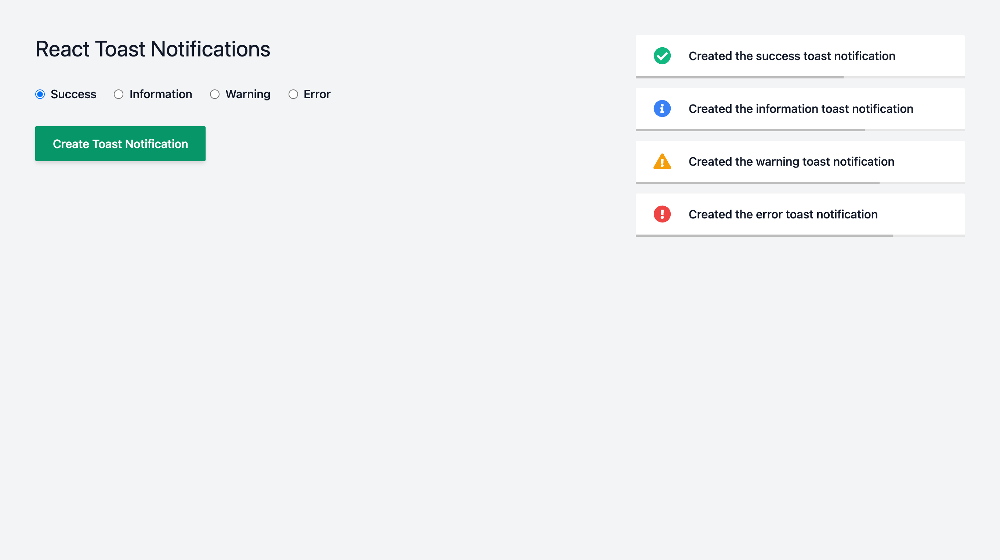

# React Toast Notifications

A toast notification library for React.



## Getting Started

### Usage

1. Wrap your component(s) in a `ToastNotificationsProvider`.

```tsx
import { ToastNotificationsProvider } from "@louis-young/react-toast-notifications";

// ...

<ToastNotificationsProvider>...<ToastNotificationsProvider>;
```

2. Access the toast notifications.

```tsx
import { useToastNotifications } from "@louis-young/react-toast-notifications";

// ...

const {
  createToastNotification,
  updateToastNotification,
  deleteToastNotification,
} = useToastNotifications();
```

3. Create a toast notification.

```tsx
createToastNotification({
  text: "Lorem ipsum dolor ipsum dolor ipsum dolor",
  type: "success",
});
```

## Documentation

### Providers

- `ToastNotificationsProvider`

#### Examples

```tsx
// ...

<ToastNotificationsProvider>...</ToastNotificationsProvider>
```

### Hooks

- `useToastNotifications`

#### Options

None (yet).

#### Returns

```tsx
{
  createToastNotification: (
    toastNotification: { text: string; type: "success" | "information" | "warning" | "error" }
  ) => { id: string; text: string; type: "success" | "information" | "warning" | "error" },,
  updateToastNotification: ({
    id,
    updatedToastNotification,
  }: {
    id: string;
    updatedToastNotification: { text: string; type: "success" | "information" | "warning" | "error" };
  }) => { id: string; text: string; type: "success" | "information" | "warning" | "error" },
  deleteToastNotification: ({ id }: { id: string }) => void
}
```

- `createToastNotification` - A function used to create a toast notification.

```ts
(toastNotification: {
  text: string;
  type: "success" | "information" | "warning" | "error";
}) => {
  id: string;
  text: string;
  type: "success" | "information" | "warning" | "error";
};
```

- `updateToastNotification` - A function used to update a toast notification.

```ts
({id: string, updatedToastNotification: {
  text: string;
  type: "success" | "information" | "warning" | "error";
}}) => {
  id: string;
  text: string;
  type: "success" | "information" | "warning" | "error";
};
```

- `deleteToastNotification` - A function used to delete a toast notification.

```ts
({id: string }) => void;
```

#### Examples

```tsx
import { useToastNotifications } from "@louis-young/react-toast-notifications";

// ...

const { createToastNotification, updateToastNotification, deleteToastNotification } = useToastNotifications();

// ...

/**
 * The create and update functions return the whole toast
 * notification so you can easily programmatically
 * update a notification's text or type.
 */

const { id, text, type } = createToastNotification({
  text: "Lorem ipsum dolor ipsum dolor ipsum dolor",
  type: "success",
});

/**
 * Update the toast notification's text.
 */

updateToastNotification({ id, { text: "Updated toast notification", type }});

/**
 * The update function also returns the whole toast
 * notification although it will typically already
 * be in scope from creation.

/**
 * Update the toast notification's type.
 */

updateToastNotification({ id, { text, type: "information" }});

/**
 * Delete the toast notification.
 */

deleteToastNotification({ id })
```
