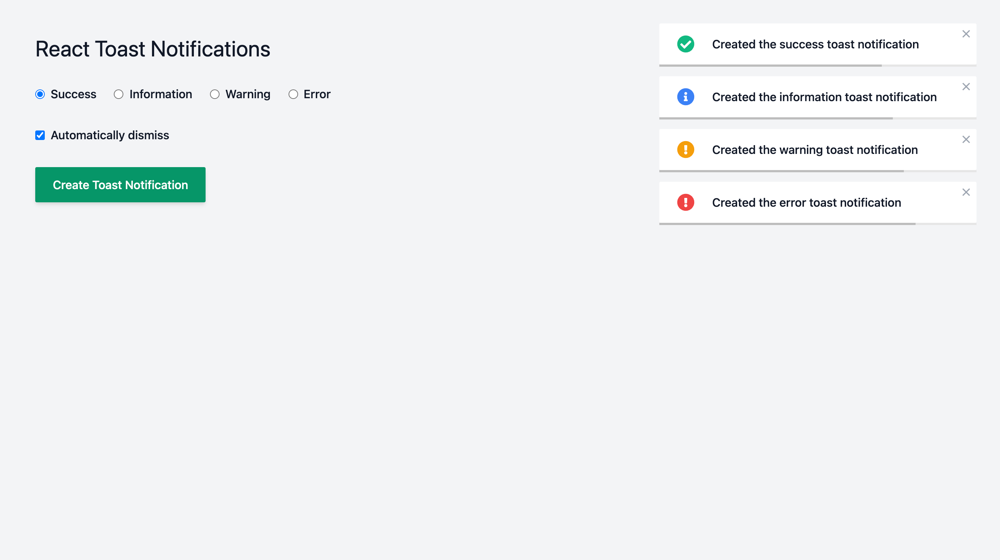

# React Toast Notifications

A toast notification library for React.



## Getting Started

### Usage

1. Wrap your component(s) in a `ToastNotificationsProvider`.

```tsx
import { ToastNotificationsProvider } from "./context/toastNotifications";

// ...

<ToastNotificationsProvider>...<ToastNotificationsProvider>;
```

2. Access the toast notifications.

```tsx
import { useToastNotifications } from "../../hooks/useToastNotifications";

// ...

const { toast } = useToastNotifications();
```

3. Create a toast notification.

```tsx
toast({
  text: "Lorem ipsum dolor ipsum dolor ipsum dolor",
  type: "success",
});
```

## Documentation

### Providers

- `ToastNotificationsProvider`

#### Examples

```tsx
// ...

<ToastNotificationsProvider>...</ToastNotificationsProvider>
```

### Hooks

- `useToastNotifications`

#### Options

None (yet).

#### Returns

- `toast` - A function used to create toast notifications.

```ts
(toastNotification: {
  text: string;
  type: "success" | "information" | "warning" | "error";
}) => {
  id: string;
  text: string;
  type: "success" | "information" | "warning" | "error";
};
```

#### Examples

```tsx
import { useToastNotifications } from "../../hooks/useToastNotifications";

// ...

const { toast } = useToastNotifications();

// ...

toast({
  text: "Lorem ipsum dolor ipsum dolor ipsum dolor",
  type: "success",
});
```
